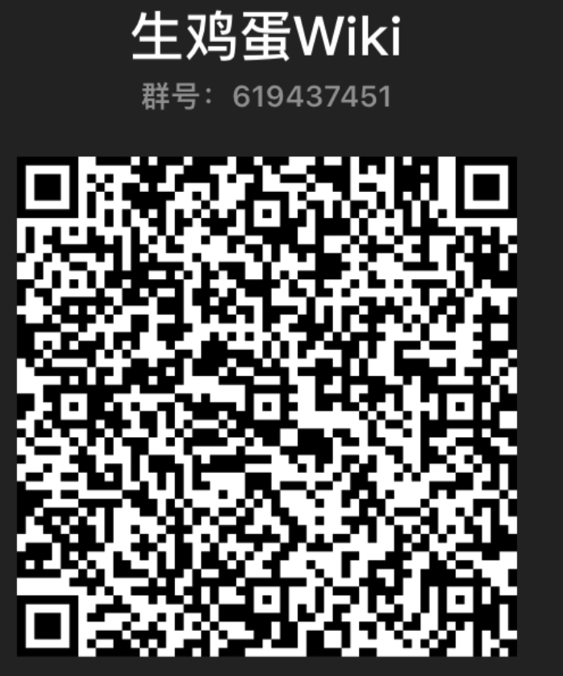

Wiki的所有文档都在仓库里，也就是左上角的GitHub仓库。

参与方式至少有3种:

+ 通过GitHub仓库提交Pull Request

+ 发邮件到ry.group@icloud.com

+ 通过社交软件投稿



参考资料：

+ [markdown教程](https://search.bilibili.com/all?keyword=markdown)

+ [MkDocs拓展的md语法](https://squidfunk.github.io/mkdocs-material/reference/admonitions/)

+ [中文技术文档写作规范](https://github.com/ruanyf/document-style-guide)

根据上面的规则，你可写出很多有意思的东西

如有标签的代码：

=== "C"

    ``` c
    #include <stdio.h>

    int main(void) {
      printf("Hello world!\n");
      return 0;
    }
    ```

=== "C++"

    ``` c++
    #include <iostream>

    int main(void) {
      std::cout << "Hello world!" << std::endl;
      return 0;
    }
    ```
=== "Go"

    ``` Go
    package main
    import "fmt"

    func main() {
        fmt.Println("Hello world!")
    }
    ```

如果你是开发者，或未来的开发者，建议你也学会

+ [Git知识](https://www.liaoxuefeng.com/wiki/896043488029600)
