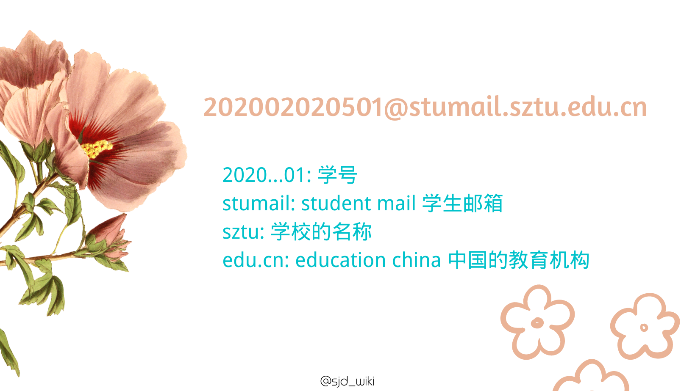

> 本文以foxmail邮箱与学校邮箱为例，在终端设备上配置自己的电子邮箱账户。

使用邮箱最便捷的方式应该是在你的电脑或者手机应用配置好，接着在应用里收发邮件，这样有更大的概率能及时阅读邮件。

## 协议介绍

首先我们可以了解一下与电子邮箱有关的网络协议，包括**SMTP**协议、**POP3**协议与**IMAP**协议。

### SMTP

SMTP是*Simple Mail Transfer Protocol*的简称，即简单邮件传输协议（25号端口）。它是一组用于从源地址到目的地址传输邮件的规范，通过它来控制邮件的中转方式。SMTP 协议属于 TCP/IP 协议簇，它帮助每台计算机在发送或中转信件时找到下一个目的地。SMTP是一个“推”的协议，它不允许根据需要从远程服务器上“拉”来消息。SMTP 服务器就是遵循 SMTP 协议的发送邮件服务器。

### POP3

POP3是*Post Office Protocol 3*的简称，即邮局协议的第3个版本,是TCP/IP协议族中的一员（默认端口是110）。本协议主要用于支持使用客户端远程管理在服务器上的电子邮件。,它规定怎样将个人计算机连接到Internet的邮件服务器和下载电子邮件的电子协议。它是因特网电子邮件的第一个离线协议标准,POP3允许用户从服务器上把邮件存储到本地主机（即自己的计算机）上,同时删除保存在邮件服务器上的邮件，而POP3服务器则是遵循POP3协议的接收邮件服务器，用来接收电子邮件的。
### IMAP

IMAP全称是*Internet Mail Access Protocol*，即交互式邮件存取协议，是一个应用层协议（端口是143）。用来从本地邮件客户端（Outlook Express、Foxmail、Mozilla Thunderbird等）访问远程服务器上的邮件。它是跟POP3类似邮件访问标准协议之一。不同的是，开启了IMAP后，您在电子邮件客户端收取的邮件仍然保留在服务器上，同时在客户端上的操作都会反馈到服务器上，如：删除邮件，标记已读等，服务器上的邮件也会做相应的动作。所以无论从浏览器登录邮箱或者客户端软件登录邮箱，看到的邮件以及状态都是一致的。

## Foxmail邮箱

foxmail.com是腾讯的邮箱，可以根据以下步骤注册一个

1. 打开网站 https://mail.qq.com
2. 用qq登陆
3. 点击左上角设置-账户-邮箱账号
4. 注册foxmail邮箱

foxmail邮箱的网络协议如下：

| 协议名称               | 服务器地址  | 服务器端口 |
| ---------------------- | ----------- | ---------- |
| 发送邮件服务器（SMTP） | smtp.qq.com | 465或587   |
| 接收邮件服务器（POP3） | pop.qq.com  | 995        |
| 接收邮件服务器（IMAP） | imap.qq.com | 993        |

## 学校邮箱

首先我们认识一下学校的邮箱账号

一番解析后，你发现学生邮箱的账户构成并不复杂

通常，所有教师的邮箱是不带stumail的。姓名拼音不重复的话，格式一般为 `名字拼音@sztu.edu.cn`

我哭死:sob:，我也想要一个这么简短的邮箱

回到正题，如何及时收到学校邮箱的邮件？

其实学校邮箱并没有给几个协议的配置链接与端口，一个一个猜又挺浪费时间，所以有个更简单的方法就是转发这个邮箱收到的邮件

步骤如下：

1. 打开网页http://mail.stumail.sztu.edu.cn

2. 登陆后点击左下角设置按钮

3. 收发信设置-自动转发-添加地址

不得不提一嘴，有了学校邮箱后，你可以获得很多学生权益

参考 https://zhuanlan.zhihu.com/p/106339690